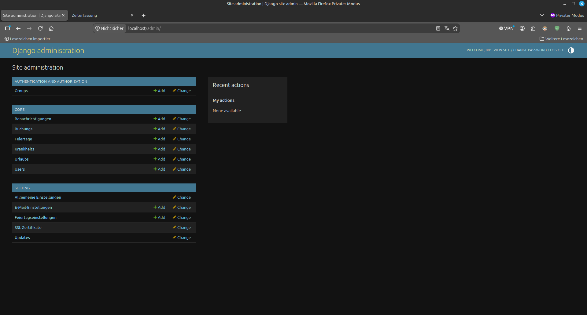
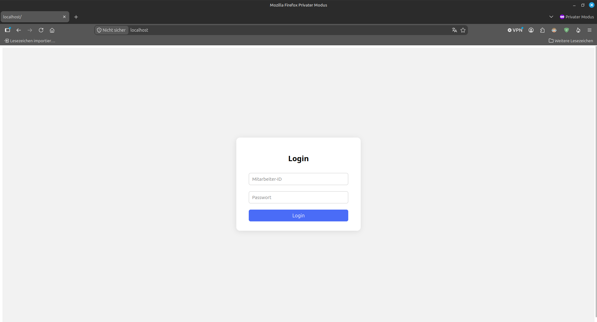
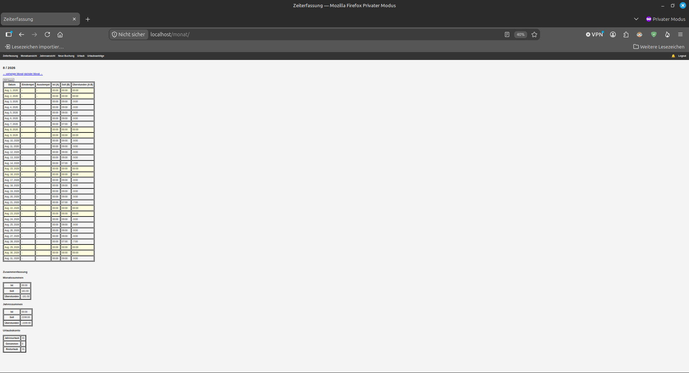
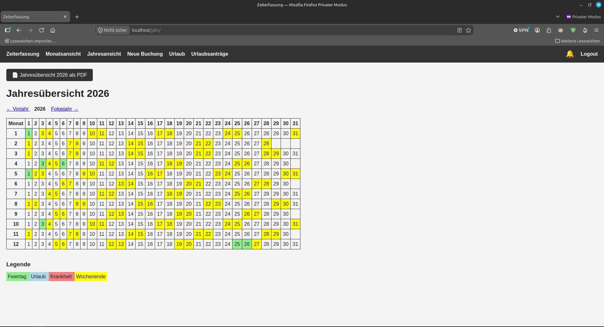
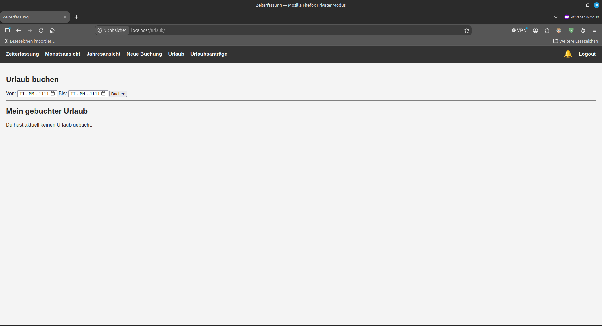
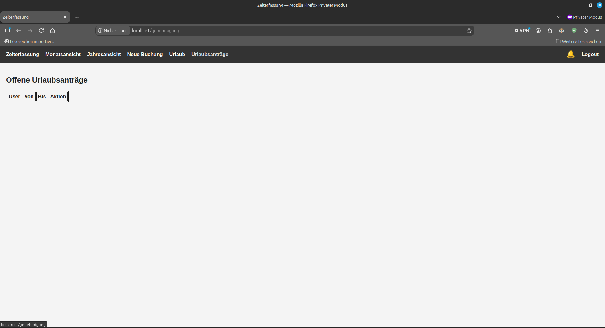

# Zeiterfassung

## HOW TO GET STARTED

### download the repo
`git clone https://github.com/Niklwas/Zeiterfassung.git`

### windows docker

Download Docker and install wsl:
wsl --install

## create file .env.prod
Linux: `nano .env.prod`
Windows: `notepad.exe .env.prod`
 
content:
```
# Django Settings
DEBUG=True #False
DJANGO_SECRET_KEY= 'super-secure-django-secret-key'
DJANGO_ALLOWED_HOSTS="*"
DJANGO_CSRF_TRUSTED_ORIGINS=https://zeiterfassung.local,https://localhost
DJANGO_ADMIN_PASSWORD=Test12345!

# Database Settings
DATABASE_ENGINE=postgresql_psycopg2
DATABASE_NAME=zeiterfassung
DATABASE_USERNAME=zeiterfassung
DATABASE_PASSWORD=zeiterfassung
DATABASE_HOST=db
DATABASE_PORT=5432

# Postgres Settings
POSTGRES_DB=zeiterfassung
POSTGRES_USER=zeiterfassung
POSTGRES_PASSWORD=zeiterfassung

#update-Container
UPDATER_SECRET=super-secure-updater-secret
UPDATER_URL=http://updater:9000
```

### create self signed certificate
```docker compose exec frontend-proxy openssl req -x509 -nodes -days 3650 -newkey rsa:4096 -keyout ./etc/nginx/certs/server.key -out ./etc/nginx/certs/server.crt -subj "/C=DE/ST=state/L=city/O=zeiterfassung/OU=IT/CN=zeiterfassung.local" ```

Linux
mkdir -p ./nginx/certs
openssl req -x509 -nodes -days 3650 -newkey rsa:4096 -keyout ./nginx/certs/server.key -out ./nginx/certs/server.crt -subj "/C=DE/ST=state/L=city/O=zeiterfassung/OU=IT/CN=zeiterfassung.local"

on windows, if Folder is on Dektop:
mkdir -p "/mnt/c/Users/<User>/Desktop/zeiterfassung/nginx/certs"
openssl req -x509 -nodes -days 3650 -newkey rsa:4096 -keyout "/mnt/c/Users/<User>/Desktop/zeiterfassung/nginx/certs/server.key" -out "/mnt/c/Users/<User>/Desktop/zeiterfassung/nginx/certs/server.crt" -subj "/C=DE/ST=state/L=city/O=zeiterfassung/OU=IT/CN=zeiterfassung.local"


### start with docker
`docker compose up -d --build`


### login admin Dashboard
`<hostname>/admin`



## Testuser:

| MID | Name            | Password   | abteilungsleiter | staffuser | admin |
| --- | ----            | ---        | ----             | ---       | ----  |  
| 001 | admin           | Test12345! | no               | yes       | yes   |

### Email-konfiguration ändern /// change Email Config !!wichtig sonst Fehler bei Genehmingungen!!

Admin-center>settings>E-Mail-Einstellungen>E-Mail-Einstellung hinzufügen


### ein-/ausschalten der lokalen Feiertage /// enable/disable local holidays

Admin-center>core>Feiertage


#### vorhande Feiertage /// current holidays

File: core/holiday_data/feiertage_{year}_de.xml

| Monat | Tag            | Bezeichnung          |
| ---   | ---            | ---                  | 
| 01    | 01             | Neujahr              | 
| 04    | 03             | karfreitag           | 
| 01    | 06             | Ostermontag          | 
| 05    | 01             | Tag der Arbeit       | 
| 05    | 14             | Christi  Himmelfahrt | 
| 25    | 05             | Pfingstmontag        | 
| 10    | 03             | Deutsche Einheit     | 
| 11    | 01             | Allerheiligen        |
| 12    | 24             | Weihnachten          | 
| 12    | 25             | 1.Weihnachtstag      | 
| 12    | 26             | 2.Weihnachtstag      | 


### Hochladen eigener Feiertage /// Upload custom holidays
Im XML-Format

```
<?xml version="1.0" encoding="UTF-8"?>

<feiertage jahr="2026">

    <feiertag>
        <monat>1</monat>
        <tag>1</tag>
        <bezeichnung>Neujahr</bezeichnung>
    </feiertag>

```

### Benutzer anlegen /// create User

### login User Dashboard
`<hostname>/`


#### Monatsansicht mit pdf export



#### jahresübersicht mit pdf export


#### Urlaubsanträge


#### if "Abeteilungsleiter": Genehmigung



## Größe

### größter speicherfresser docker build cache: 
` docker system df `

docker system df
| TYPE            | TOTAL    | ACTIVE   | SIZE      |   RECLAIMABLE     |
| ---             | ---      | ---      | ---       |   ---             |
| Images          | 4        | 4        | 2.221GB   |   0B (0%)         |
| Containers      | 4        | 3        | 135.2kB   |   16.38kB (12%)   |
| Local Volumes   | 3        | 3        | 50.63MB   |   0B (0%)         |
| Build Cache     | 39       | 0        | 549.9MB   |   549.9MB         |
| Total           |          |          | 2.9 GB    |                   | 

- leeren mit: `docker builder prune`

minimum requirements*: 
    - 20 GB Diskspace
    - 2 GB RAM

*only recommendations, not tested in production yet

## Updates

Linux:
`./update.sh v1.0.260829 `
